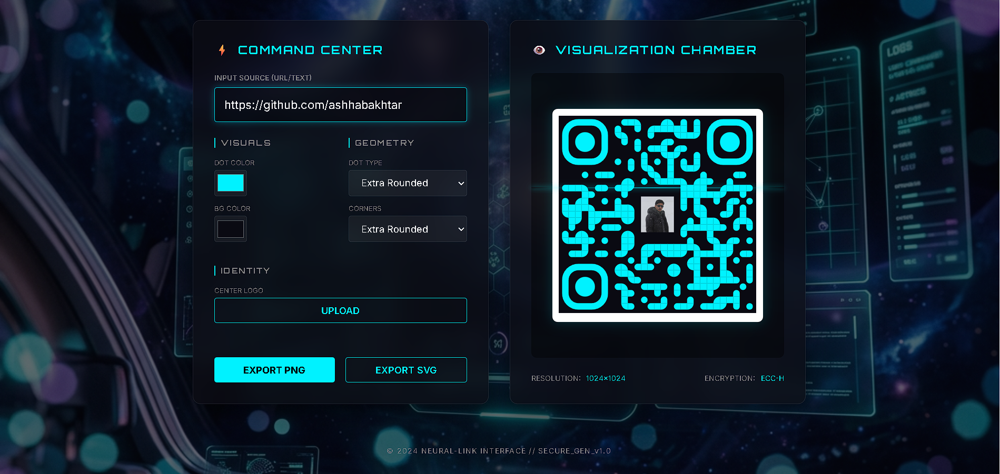

# 🌌 OMNI-LINK | Neural QR Generator

<div align="center">


**A premium, high-fidelity QR generation interface with a futuristic sci-fi aesthetic.**

[Live Demo](https://ashhabakhtar.github.io/OMNI-LINK/) • [Report Bug](https://github.com/ashhabakhtar/OMNI-LINK/issues) • [Request Feature](https://github.com/ashhabakhtar/OMNI-LINK/issues)

</div>

---

## ⚡ Overview

Omni-Link: A premium, sci-fi themed QR generator. Transform links into high-fidelity codes with glassmorphism aesthetics, neon accents, and real-time preview. Customize dot shapes, colors, and logos with a futuristic Neural-Link UI. Export high-res PNG/SVG instantly for a state-of-the-art experience.

## ✨ Key Features

- 🧬 **Neural-Link UI**: Sleek, glassmorphism-based control panel with animated scan lines.
- 🎨 **Dynamic Customization**: Change dot colors, background colors, and geometry (shapes/corners) in real-time.
- 🖼️ **Logo Integration**: Upload your center logo to personalize your QR codes.
- 💾 **High-Res Exports**: Download high-quality PNG or SVG files directly from the browser.
- 📱 **Fully Responsive**: Optimized for desktop and mobile visualization.

## 🛠️ Built With

- **HTML5** - Semantic structure.
- **CSS3** - Glassmorphism, animations, and responsive design.
- **JavaScript** - Core logic and event handling.
- **[QR Code Styling](https://github.com/denisoed/qr-code-styling)** - The heavy lifter for stylish QR generation.

## 🚀 Getting Started

To run this project locally:

1. **Clone the repository**
   ```bash
   git clone https://github.com/ashhabakhtar/OMNI-LINK.git
   ```

2. **Navigate to the directory**
   ```bash
   cd OMNI-LINK
   ```

3. **Open `index.html`**
   Simply open the `index.html` file in your preferred browser.

## 📸 Preview

<div align="center">
  
</div>

---

<div align="center">
  Developed by <a href="https://github.com/ashhabakhtar">Ashhab Akhtar</a> // SECURE_GEN_v1.0
</div>
